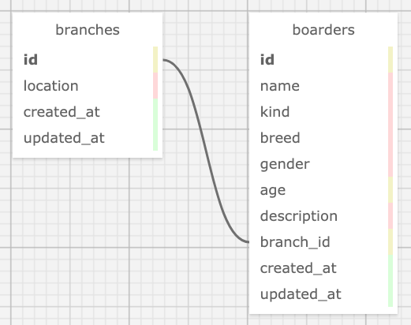

# Helter Shelter API (v1)
## _A back-end Ruby on Rails API to connect people with adoptable pets._
### by: Micah L. Olson
### created: 4/2/2021

---

## Description
This back-end `Ruby on Rails` API provides records of all *Helter Shelter* branches in the Portland, OR, metropolitan area, and the animals they each have available for adoption. **No API key** is required to use this service. It has been enabled for **CORS** and supplies full **CRUD** functionality.

---

## API Endpoints
* The image below summarizes all available **endpoints**.

* For **comprehensive details** on each endpoint and usage examples, click here:  
  [API Endpoints and Usage Examples](README-API.pdf) (be patient, this page loads slowly)  

* Follow [*Installation and Setup*](#installation-and-setup) instructions below to locally interact with this API through a [`swagger`](http://swagger.io/) front-end.  
  
### Summary 


---

## Technologies
* Ruby
* Rails
* Bundler
* Rake
* PostgreSQL
* Faker
* Puma
* Rack::Cors
* RSpec
* FactoryBot
* SimpleCov
* Swagger::Docs
* swagger-ui
* git

---

## Requirements
* You will need to use your system's **`terminal` emulator** to set up and locally use this API.

* **`PostgreSQL 12.6`** is required to serve this application's database.  
  ([how to install PostgreSQL 12.6](https://www.learnhowtoprogram.com/ruby-and-rails/getting-started-with-ruby/installing-postgres))

* You must have **`Ruby 2.6.5`** installed to be able to run this application.  
  ([how to install Ruby 2.6.5](https://www.learnhowtoprogram.com/ruby-and-rails/getting-started-with-ruby/installing-ruby))

* **`Bundler`** is needed to install all application dependencies. Install it *after* you install `Ruby`.
  ```bash
  $ gem install bundler
  ```

---

## Installation and Setup
* **Clone this repository** to a local directory using the command-line tools `cd` and `git`.  
  ([how to install git](https://www.learnhowtoprogram.com/introduction-to-programming/getting-started-with-intro-to-programming/git-and-github))
  ```bash
  $ cd ~/<local_directory>/
  $ git clone https://github.com/MicahOlson/helter_shelter_api.git
  ```

* **Navigate to the top level directory** of the cloned repository.  
  ```bash
  $ cd helter_shelter_api/
  ``` 

* **Install all application dependencies** using `Bundler`.
  ```bash
  $ bundle install
  ```

* **Start the `PostgreSQL` database system** and keep it running while you interact with this service.
  ```bash
  $ postgres
  ```

  * Access the command line again by opening another `terminal` tab. Press and briefly hold these key combinations.  
    `command-t` (macOS) or `control-t` (Windows, GNU/Linux)

  * IMPORTANT! Be sure to **shut the database system down** when you are done using the app.  
    `control-c`

* **Recreate the databases** and **seed** a sample dataset.
  ```bash
  $ bundle exec rake db:setup
  ```

* The following **database schema** is automatically created by the above command.
  <div>
    
  </div>

* **Launch the local `Puma` web server** to start the API service.
  ```bash
  $ rails server
  ```

  * IMPORTANT! Be sure to **shut the web server down** when you are done using the app.  
    `control-c`

* Type **localhost:3000** into your browser's address bar and hit `enter`.

---

## Testing
* This service was created following a **test-driven development** (TDD) process.
  * **37 tests** covering **99.12%** of the code base.

* ***Unit* and *integration* test suites** can be found in `spec/models` and `spec/requests` respectively.

* **Read the test specs** using `cat` (ex. below), or open the files in a code editor (see [*Code Editors*](#code-editors)).
  ```bash
  $ cat spec/models/branch_spec.rb
  ```

* **Run the tests** yourself using `RSpec` to verify correct program functionality.
  ```bash
  $ rspec
  ```

---

## Code Editors
* **Recommendations** if you would like to utilize a **GUI** for opening or editing this application's files:
  * [Visual Studio Code](https://code.visualstudio.com) - "Code editing. Redefined."
  * [Atom](https://atom.io) - "A hackable text editor for the 21st Century."
  * [SublimeText](https://www.sublimetext.com) - "A sophisticated text editor for code, markup and prose."

---

## Notes, Bugs, Fixes, and Future Improvements
* No known bugs.
* There are no feature enhancements scheduled for this service.
* If you find a bug, please report it at the email address below.

---

## License
[GPLv3](https://choosealicense.com/licenses/gpl-3.0/)  
Copyright &copy; 2021 Micah L. Olson

---

## Contact Information
Micah L. Olson by 
<a href="mailto:micah.olson@protonmail.com" target="_blank">email</a> 
or at 
<a href="https://www.linkedin.com/in/micah-lewis-olson/" target="_blank">LinkedIn</a>.
